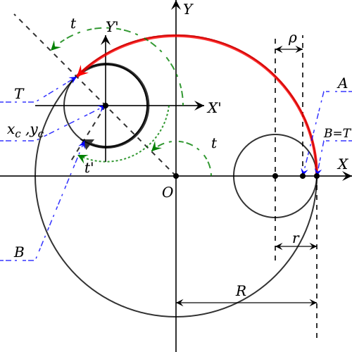

## :seedling:

#### Recent

- [png-compressor](https://github.com/eliot-akira/png-compressor) - Compress and encode data as PNG image
- [ulisp-wasm](https://github.com/eliot-akira/ulisp-wasm) - uLisp for WebAssembly
  - [codemirror-lang-ulisp](https://github.com/eliot-akira/codemirror-lang-ulisp) - uLisp language support for CodeMirror editor
- [zxel](https://github.com/eliot-akira/zxel) - Interactive terminal shell for JavaScript runtimes with syntax highlight and zx utilities

#### Media

- [neko](https://github.com/eliot-akira/neko) - Neko is a cross-platform open-source animated cursor-chasing cat screenmate application
- [microcity](https://github.com/eliot-akira/microcity) - Miniature city simulation evolved from Micropolis
- [mooz](https://github.com/moozap/mooz) - Modules for web audio and music
- [brushlib-wasm](https://github.com/eliot-akira/brushlib-wasm) - Brush engine based on WebAssembly port of MyPaint
- [gitmoji](https://github.com/eliot-akira/gitmoji) - Overview of Gitmoji Markdown
- [tetris](https://github.com/eliot-akira/tetris) - Rotate tetrominoes as they fall and complete rows to clear them
- [visual-programming-environments](https://github.com/eliot-akira/visual-programming-environments) - Examples of visual programming environments

#### Builder

- [immerst](https://github.com/eliot-akira/immerst) - Modular immutable state management
- [testra](https://github.com/eliot-akira/testra) - Minimal test runner
- [base64-compressor](https://github.com/eliot-akira/base64-compressor) - Compress and encode data as URL-safe base64 string
- [zip-compressor](https://github.com/eliot-akira/zip-compressor) - Encode and decode zip files with CompressionStream
- [tangible-roller](https://github.com/TangibleInc/tangible-roller) - Build project assets using Rollup and ESBuild 
- [template-system](https://github.com/TangibleInc/template-system) - A template system for WordPress with content type loops and conditions 
- [php-beautify](https://github.com/expreva/php-beautify) - Format PHP source code in Node/Bun using PHP WebAssembly to apply WordPress Code Standards
- [php-parser](https://github.com/expreva/php-parser) - Parse PHP source code in Node/Bun using PHP WebAssembly
- [git-subrepo](https://github.com/TangibleInc/git-subrepo) - Wrapper to use `git-subrepo` as NPM package and command

#### Language

- [waxolotl](https://github.com/eliot-akira/waxolotl) - A small language that compiles to WebAssembly Text format
- [zig-playground](https://github.com/eliot-akira/zig-playground) - Zig compiler and language server in the browser
- [estreval](https://github.com/expreva/estreval) - Evaluate JavaScript abstract syntax tree in ESTree format
- [tstree](https://github.com/expreva/tstree) - Parse TypeScript code into ESTree-compatible abstract syntax tree
- [expreva](https://github.com/expreva) - Expreva is a language based on arithmetic and algebra expressions

## :eyes:

#### Projects

- [typescript-go](https://github.com/microsoft/typescript-go) - TypeScript 7 being implemented in Go
- [xcc](https://github.com/tyfkda/xcc) -  Standalone C compiler/assembler/linker/libc for x86-64/aarch64/riscv64/wasm
- [uLisp](http://www.ulisp.com/) - Lisp for Microcontrollers
- [Make a Lisp](https://github.com/kanaka/mal)
- [Ink & Switch](https://www.inkandswitch.com)
  - [End-user programming](https://www.inkandswitch.com/end-user-programming/)
  - [Dynamic documents as personal software](https://www.inkandswitch.com/potluck/)
  - [Local-first software](https://www.inkandswitch.com/local-first/)
- [Explorable Explanations](https://explorabl.es/all/)
- [unified](https://unifiedjs.com/) - Interface for parsing, inspecting, transforming, and serializing content through syntax trees 
- [Vexflow](https://github.com/vexflow/vexflow) - TypeScript library for rendering music notation
- [VexML](https://github.com/stringsync/vexml) - MusicXML score layout and rendering using Vexflow
- [WordPress Playground](https://github.com/WordPress/wordpress-playground) - Run WordPress in the browser via WebAssembly PHP

#### People

- [Anders Hejlsberg](https://github.com/ahejlsberg)
- [Fabrice Bellard](https://bellard.org/)
- [Lingdong Huang](https://github.com/LingDong-)
- [Justine Tunney](https://github.com/jart)
- [Bret Victor](https://worrydream.com/)
- [Lu Wilson](https://github.com/TodePond/)
- [Daniel Shiffman](https://github.com/shiffman)
- [Adam Zieliński](https://github.com/adamziel)
- [Maggie Appleton](https://maggieappleton.com/)
- [Mary Rose Cook](https://maryrosecook.com/)
- [Simon Willison](https://github.com/simonw)
- [Lup Yuen Lee](https://lupyuen.org/)
- [wooorm](https://github.com/wooorm)
